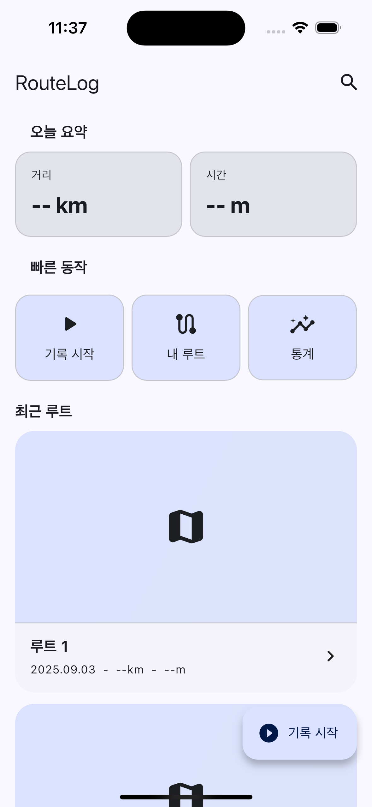
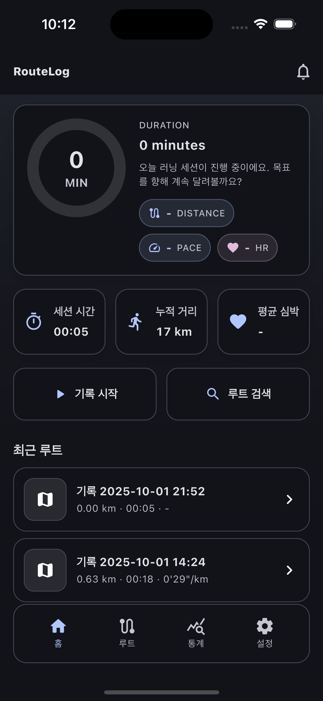
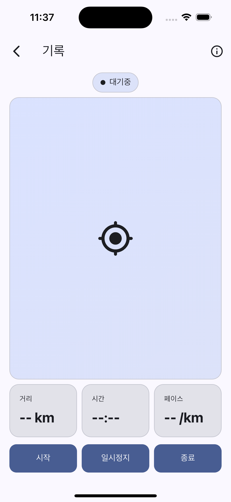
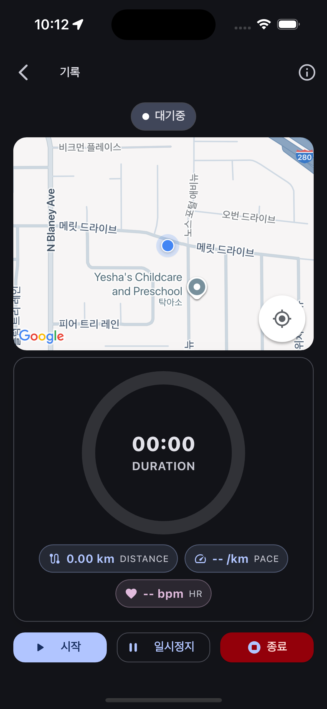
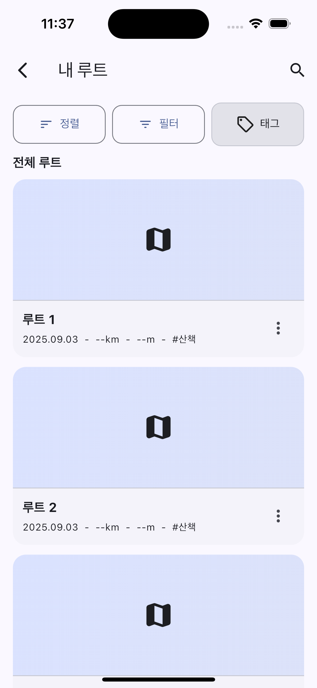
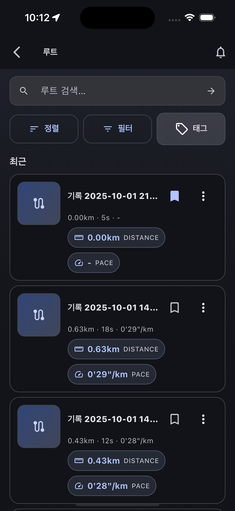
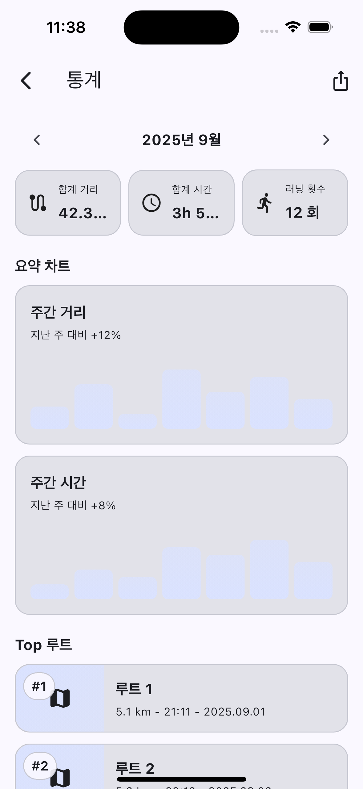
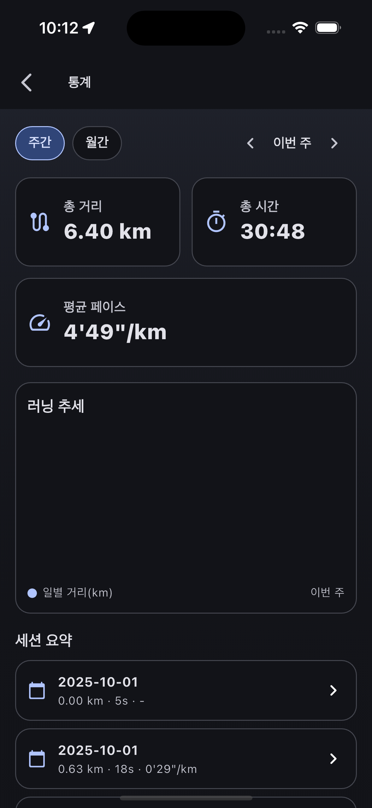

# routelog_project

러닝/워킹 루트 기록 앱. **GPS로 경로 추적**, **거리/시간/페이스 통계**, **루트 리스트/상세/검색**, **라이트/다크 테마** 지원.

> iOS 최소 13.0. 현재 Firebase는 제외 상태(추가 예정 시점에 재설정).

---

## 📸 스크린샷 (목업 vs 최종본)

| 화면 | 목업(Mock) | 최종본(Final) |
|---|---|---|
| **Home** |  |  |
| **Record** |  |  |
| **Routes** |  |  |
| **Stats** |  |  |

---

## ✨ 주요 기능
- 실시간 경로 기록(시작/일시정지/종료) + 지도 렌더링
- 이동 거리, 시간, 평균 페이스 등 기본 메트릭 표시
- 루트 리스트/필터/정렬 및 상세 화면 골격 구성
- 홈: 요약 카드, 퀵 액션, 최근 루트 섹션
- 통계: 월 선택 바, 주간 거리 미니 차트 등 UI 목업
- 설정: 테마(시스템/라이트/다크) 등 앱 환경 옵션
- 일관된 카드/섹션 컴포넌트, 빈/에러/스켈레톤 상태 컴포넌트

---

## 🧩 기술 스택
- Flutter (Dart) / Material 3
- iOS 최소 13.0 (CocoaPods 통합 완료: *Flutter*, *shared_preferences_foundation*)
- 현재 **Firebase 제외** 상태 (향후 추가 예정)

### pubspec 주요 의존성
- `cupertino_icons`: ^1.0.8
- `geolocator`: ^14.0.2
- `google_maps_flutter`: ^2.13.1
- `intl`: ^0.20.2
- `path_provider`: ^2.1.5
- `permission_handler`: ^12.0.1
- `shared_preferences`: ^2.2.2

---

## 🌗 테마
- `core/theme` 아래에서 라이트/다크/시스템 모드 지원
- 공통 radius, 카드/앱바 규칙 등 UI 일관성 유지

---

## 🧭 내비게이션
- `core/navigation` 라우터에서 화면 전환 제어
- 기능별 화면은 `features/<domain>`로 분리

---

## 🧪 상태/컴포넌트
- 공통 상태 위젯: 빈 상태, 에러 상태, 스켈레톤 리스트 등
- 카드/섹션/타일 등 재사용 위젯로 UI 구성 가속

---

## 🗺️ 지도 & 기록 (현재 상태)
- 기록 화면: 지도 표시 + 메트릭 표기 UI 골격
- 일부 기능은 목업 단계(실데이터 연결 전)
- Google Maps 사용 중

---

## 🗂️ 브랜치
- `main`: 안정 상태
- `develop`: 작업 기본 브랜치
- `design`: 디자인 폴리시/마감 전 시각 보정

---

## 🛣️ 로드맵(요약)
- [x] UI 모형/테마/레이아웃 정리
- [x] 라우트 리스트/상세 기본 골격
- [x] 기록 화면 기본 인터랙션(시작/정지/종료) UI
- [ ] 위치 권한/정확도/백그라운드 정책 정리
- [ ] 지도 SDK 확정(요금/제한 검토) 및 연동
- [ ] 기록 세션 저장/불러오기(로컬 → 백엔드 확장)
- [ ] 통계 지표 계산/차트 고도화
- [ ] 테스트/릴리즈 준비

---

## 🙌 기여
- 개인 프로젝트이므로 외부 기여는 현재 받지 않음(변경될 수 있음).
